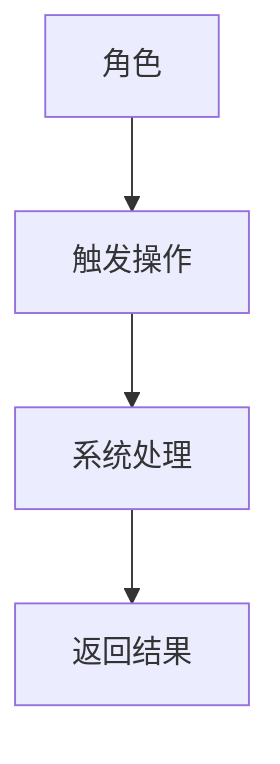
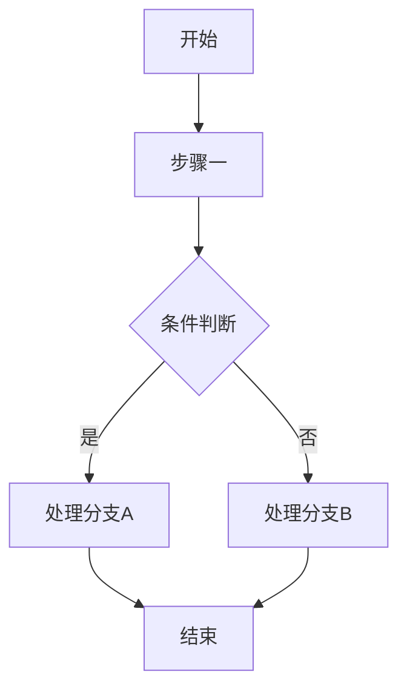
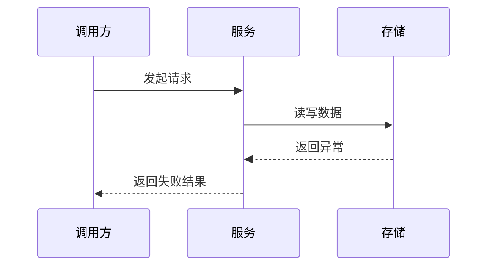
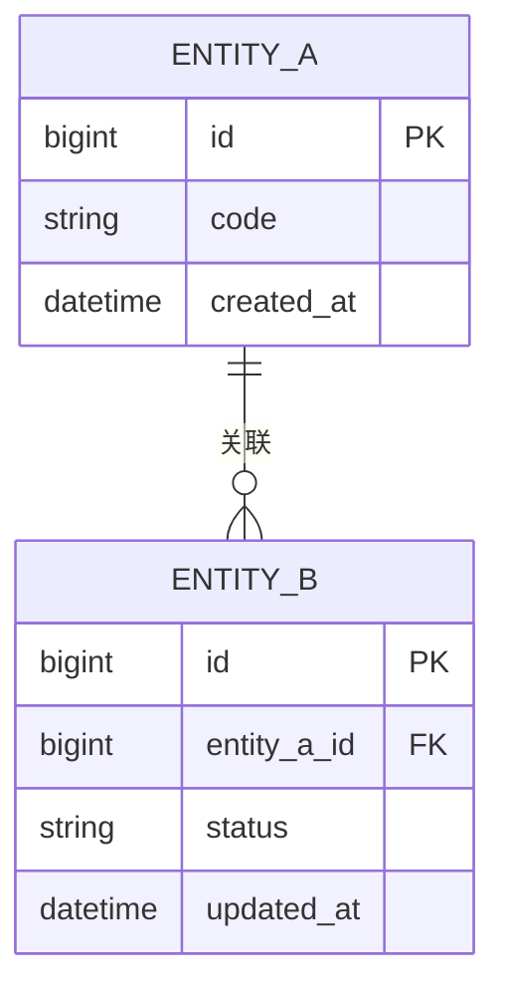
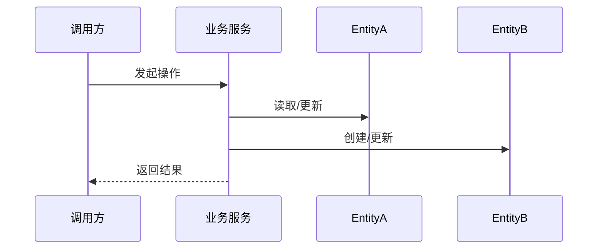

# 一、需求背景

> 结构约束：必须保留本模板的一级/二级标题名称与顺序。允许在章节内部补充设计说明、表格、Mermaid 和必要的轻量实施提示，但不得新增、删除、合并或重排一级章节；如某章节不涉及，保留标题并填写“无”及原因。
>
> 内容边界：本模板仅承载需求背景、范围边界、业务流程、接口设计、实体操作、数据库设计、风险与约束等设计内容；不得写入详细任务拆解、逐步执行步骤、排期信息或可直接替代开发任务文档的实施清单。详细执行计划统一写入 `docs/{需求名称}/开发任务.md`。

- 背景问题：
- 业务目标：
- 改造动因：
- PRD 地址：

# 二、需求概述

- 一句话概述：
- 核心能力：
- 成功标准：

# 三、功能范围

| 分类 | 内容 | 说明 |
|------|------|------|
| 本期范围 |  |  |
| 非本期范围 |  |  |
| 边界说明 |  |  |

# 四、需求用例

| 角色 | 用例场景 | 前置条件 | 触发动作 | 后置结果 |
|------|----------|----------|----------|----------|
|  |  |  |  |  |



# 五、功能点分析

| 模块 | 功能点 | 功能点描述 | 本期范围 | 影响系统 | 备注 |
|------|--------|------------|----------|----------|------|
|  |  |  | ✓ / - |  |  |

> 说明：`✓` 表示本期实现，`-` 表示不在本期范围内。

# 六、功能列表

| 功能编号 | 功能名称 | 输入 | 输出 | 依赖实体/服务 | 验收标准 |
|----------|----------|------|------|---------------|----------|
| F-01 |  |  |  |  |  |

# 七、业务流程

## 7.1 主流程



## 7.2 异常流程（如有）



# 八、ER图



> 如无新增实体，请明确说明复用现有实体关系。

# 九、核心接口定义（Dubbo / HTTP / 定时任务 / MQ）

## 9.1 Dubbo 接口

| 接口名称 | 调用方 | 提供方 | 入参 | 出参 | 幂等/重试 | 异常处理 | 说明 |
|----------|--------|--------|------|------|-----------|----------|------|
|  |  |  |  |  |  |  |  |

## 9.2 HTTP 接口

| 接口名称 | Method/Path | 调用方 | 入参 | 出参 | 权限/鉴权 | 异常处理 | 说明 |
|----------|-------------|--------|------|------|-----------|----------|------|
|  |  |  |  |  |  |  |  |

## 9.3 定时任务

| 任务名称 | 调度周期 | 输入来源 | 执行逻辑 | 输出/副作用 | 重试策略 | 说明 |
|----------|----------|----------|----------|-------------|----------|------|
|  |  |  |  |  |  |  |

## 9.4 MQ

| Topic/Queue | Producer | Consumer | 消息体 | 触发时机 | 重试/死信 | 说明 |
|-------------|----------|----------|--------|----------|-----------|------|
|  |  |  |  |  |  |  |

# 十、操作流程（操作 Entity 实体）

| 操作名称 | 涉及 Entity | 读写顺序 | 状态变更 | 事务边界 | 一致性要求 | 说明 |
|----------|-------------|----------|----------|----------|------------|------|
|  |  |  |  |  |  |  |



# 十一、数据库设计

## 11.1 MySQL

### 表结构设计

```sql
-- 在此填写表结构 DDL
```

### 字段说明

| 表名 | 字段名 | 类型 | 约束/索引 | 含义 | 是否新增 |
|------|--------|------|-----------|------|----------|
|  |  |  |  |  |  |

## 11.2 Redis

| Key | Value 结构 | TTL | 更新时机 | 失效策略 | 说明 |
|-----|-------------|-----|----------|----------|------|
|  |  |  |  |  |  |

## 11.3 ES

| 索引名 | Mapping/关键字段 | 同步来源 | 同步方式 | 查询场景 | 说明 |
|--------|-------------------|----------|----------|----------|------|
|  |  |  |  |  |  |

## 11.4 Cache

| 缓存对象 | 命中策略 | 失效时机 | 一致性策略 | 说明 |
|----------|----------|----------|------------|------|
|  |  |  |  |  |

# 十二、实施说明

- 改造范围与落点摘要：
- 上下游依赖与联调注意事项：
- 发布/切换注意事项：
- 风险与注意事项：
- 开发任务文档：`docs/{需求名称}/开发任务.md`
- 使用说明：本章节仅提供轻量实施提示，不承载详细执行计划；实现与测试阶段请优先读取开发任务文档，技术设计文档用于理解背景、接口、实体与数据设计。
