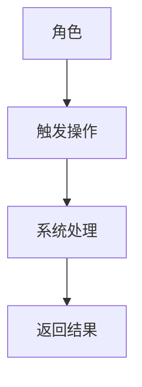
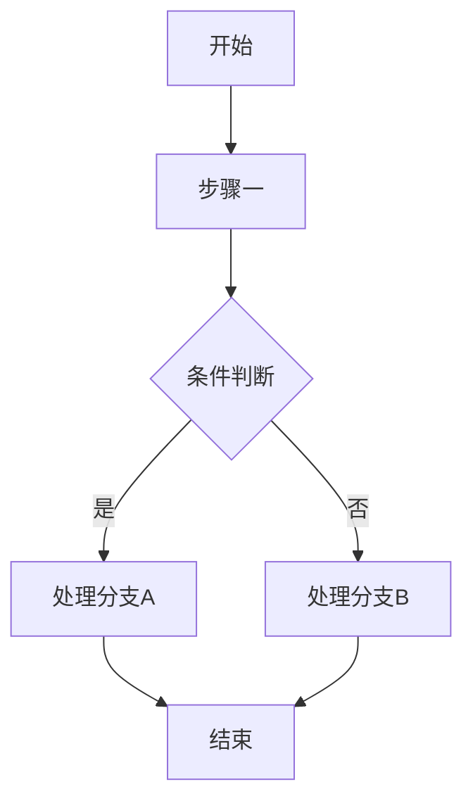
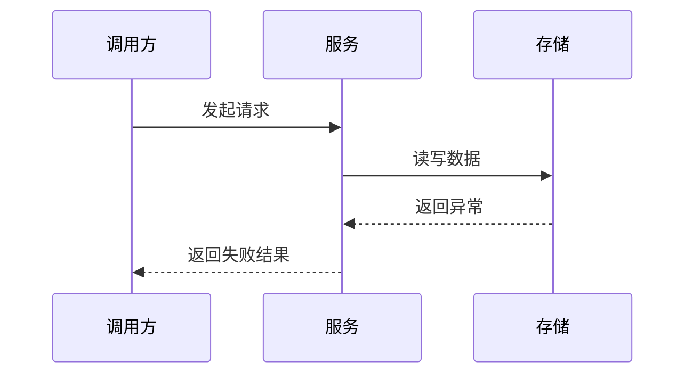
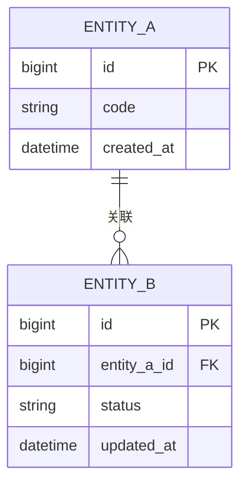
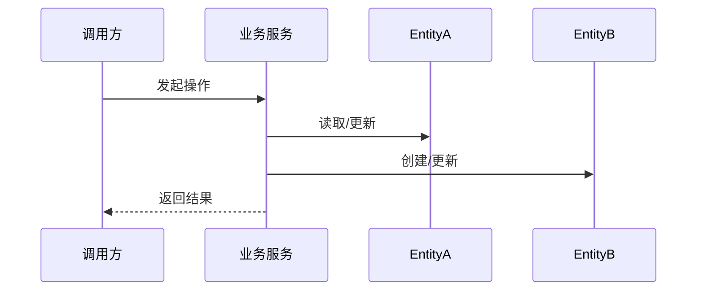

# 一、需求背景

- 背景问题：
- 业务目标：
- 改造动因：
- PRD 地址：

# 二、需求概述

- 一句话概述：
- 核心能力：
- 成功标准：

# 三、功能范围

| 分类 | 内容 | 说明 |
|------|------|------|
| 本期范围 |  |  |
| 非本期范围 |  |  |
| 边界说明 |  |  |

# 四、需求用例

| 角色 | 用例场景 | 前置条件 | 触发动作 | 后置结果 |
|------|----------|----------|----------|----------|
|  |  |  |  |  |



# 五、功能点分析

| 模块 | 功能点 | 功能点描述 | 本期范围 | 影响系统 | 备注 |
|------|--------|------------|----------|----------|------|
|  |  |  | ✓ / - |  |  |

> 说明：`✓` 表示本期实现，`-` 表示不在本期范围内。

# 六、功能列表

| 功能编号 | 功能名称 | 输入 | 输出 | 依赖实体/服务 | 验收标准 |
|----------|----------|------|------|---------------|----------|
| F-01 |  |  |  |  |  |

# 七、业务流程

## 7.1 主流程



## 7.2 异常流程（如有）



# 八、ER图



> 如无新增实体，请明确说明复用现有实体关系。

# 九、核心接口定义

## 9.1 Dubbo 接口

| 接口名称 | 调用方 | 提供方 | 入参 | 出参 | 幂等/重试 | 异常处理 | 说明 |
|----------|--------|--------|------|------|-----------|----------|------|
|  |  |  |  |  |  |  |  |

## 9.2 HTTP 接口

| 接口名称 | Method/Path | 调用方 | 入参 | 出参 | 权限/鉴权 | 异常处理 | 说明 |
|----------|-------------|--------|------|------|-----------|----------|------|
|  |  |  |  |  |  |  |  |

## 9.3 定时任务

| 任务名称 | 调度周期 | 输入来源 | 执行逻辑 | 输出/副作用 | 重试策略 | 说明 |
|----------|----------|----------|----------|-------------|----------|------|
|  |  |  |  |  |  |  |

## 9.4 MQ

| Topic/Queue | Producer | Consumer | 消息体 | 触发时机 | 重试/死信 | 说明 |
|-------------|----------|----------|--------|----------|-----------|------|
|  |  |  |  |  |  |  |

# 十、操作流程（操作 Entity 实体）

| 操作名称 | 涉及 Entity | 读写顺序 | 状态变更 | 事务边界 | 一致性要求 | 说明 |
|----------|-------------|----------|----------|----------|------------|------|
|  |  |  |  |  |  |  |



# 十一、数据库设计

## 11.1 MySQL

### 表结构设计

```sql
-- 在此填写表结构 DDL
```

### 字段说明

| 表名 | 字段名 | 类型 | 约束/索引 | 含义 | 是否新增 |
|------|--------|------|-----------|------|----------|
|  |  |  |  |  |  |

## 11.2 Redis

| Key | Value 结构 | TTL | 更新时机 | 失效策略 | 说明 |
|-----|-------------|-----|----------|----------|------|
|  |  |  |  |  |  |

## 11.3 ES

| 索引名 | Mapping/关键字段 | 同步来源 | 同步方式 | 查询场景 | 说明 |
|--------|-------------------|----------|----------|----------|------|
|  |  |  |  |  |  |

## 11.4 Cache

| 缓存对象 | 命中策略 | 失效时机 | 一致性策略 | 说明 |
|----------|----------|----------|------------|------|
|  |  |  |  |  |

# 十二、详细执行计划

## 12.1 开发阶段划分

| 阶段 | 目标 | 主要输出 | 前置依赖 |
|------|------|----------|----------|
| 数据准备 |  |  |  |
| 实体与存储 |  |  |  |
| 接口实现 |  |  |  |
| 异步与补充能力 |  |  |  |
| 测试与验收 |  |  |  |

## 12.2 功能任务清单

| 任务编号 | 功能名称 | 实现目标 | 对应技术方案章节 | 优先级 | 备注 |
|----------|----------|----------|------------------|--------|------|
| T-01 |  |  |  | P0 |  |

## 12.3 所有接口实现（Dubbo / HTTP / 定时任务 / MQ）

### 12.3.1 Dubbo 接口实现

| 接口名称 | 所在模块 | 依赖实体 | 依赖服务 | 前置条件 | 验证方式 | 备注 |
|----------|----------|----------|----------|----------|----------|------|
|  |  |  |  |  |  |  |

### 12.3.2 HTTP 接口实现

| 接口名称 | Method/Path | 所在模块 | 依赖实体 | 依赖服务 | 前置条件 | 验证方式 | 备注 |
|----------|-------------|----------|----------|----------|----------|----------|------|
|  |  |  |  |  |  |  |  |

### 12.3.3 定时任务实现

| 任务名称 | 调度周期 | 所在模块 | 依赖实体 | 执行目标 | 前置条件 | 验证方式 | 备注 |
|----------|----------|----------|----------|----------|----------|----------|------|
|  |  |  |  |  |  |  |  |

### 12.3.4 MQ 实现

| Topic/Queue | Producer | Consumer | 所在模块 | 依赖实体 | 触发条件 | 验证方式 | 备注 |
|-------------|----------|----------|----------|----------|----------|----------|------|
|  |  |  |  |  |  |  |  |

## 12.4 依赖项（前置实体实现）

| 依赖项名称 | 类型 | 新增/复用/改造 | 被哪些接口依赖 | 完成优先级 | 备注 |
|------------|------|-----------------|----------------|------------|------|
|  | Entity/DTO/DO/Repository/Config/Enum |  |  | P0 |  |

## 12.5 详细接口流程

| 名称 | 类型 | 主流程 | 调用链路 | 数据读写 | 事务边界 | 异常处理 | 验证点 | 来源章节 |
|------|------|--------|----------|----------|----------|----------|--------|----------|
|  | Dubbo/HTTP/定时任务/MQ |  |  |  |  |  |  |  |

## 12.6 测试与验收建议

- 核心正常路径：
- 关键异常路径：
- 依赖验证项：
- 建议测试命令：
