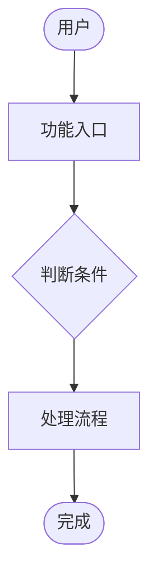
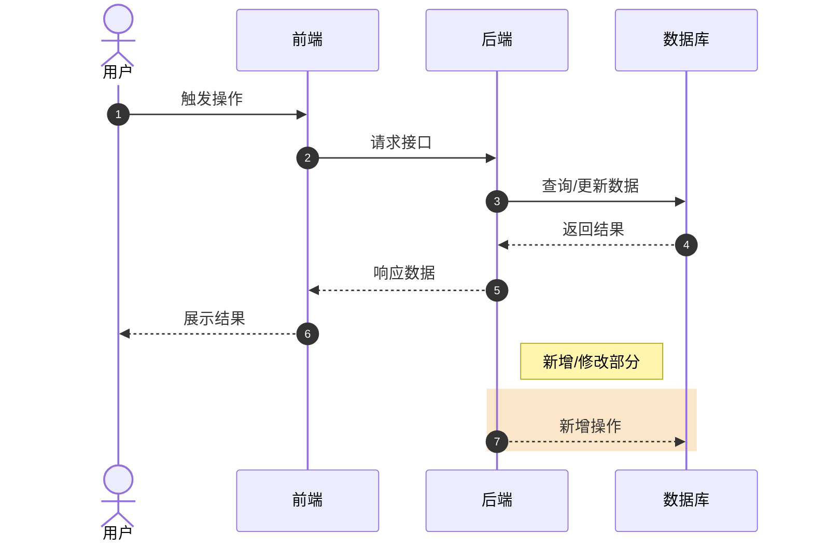
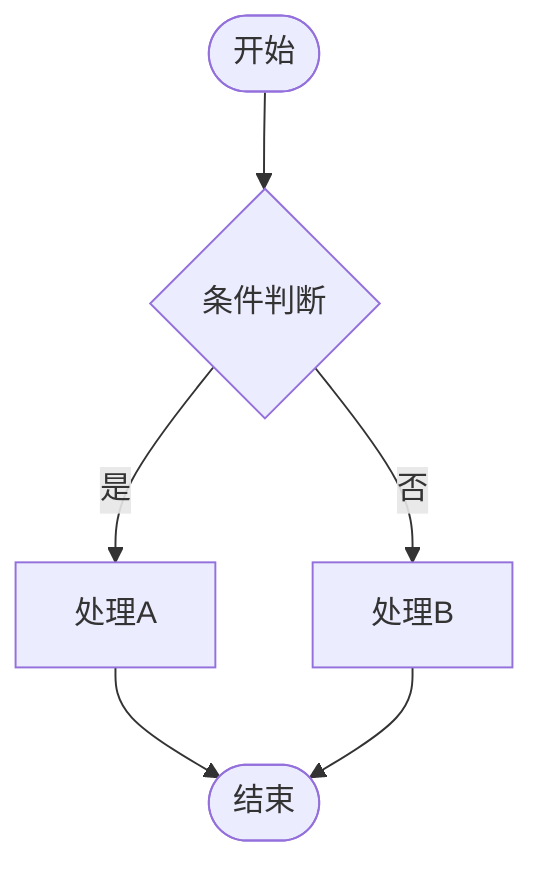
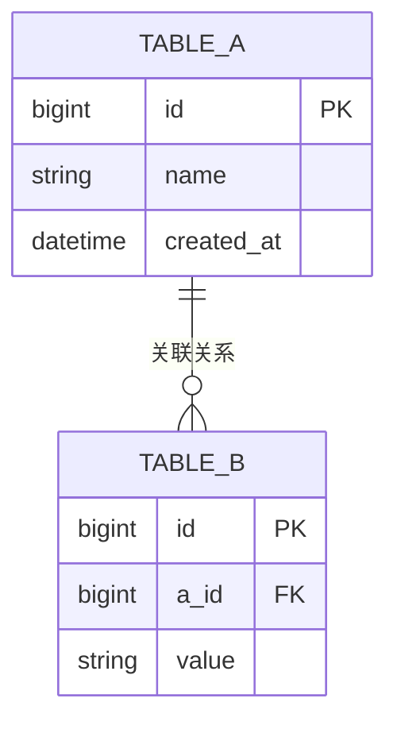

# 技术方案生成命令

本命令根据飞书 PRD 文档和用户辅助说明，生成符合规范的服务端技术设计文档。

## Context

- 当前路径: !`pwd`
- 当前应用名: !`basename $(pwd)`
- 当前分支: !`git rev-parse --abbrev-ref HEAD 2>/dev/null || echo "(空仓库)"`
- PRD链接: $ARGUMENTS
- 辅助说明: 从 $ARGUMENTS 中提取非链接部分

## 工作目标

根据飞书 PRD 文档生成结构化的技术设计文档，保存到 `./docs/{需求名称}/技术设计.md`

## 工作流程

### 步骤 1：解析输入

分析用户输入，提取：
- PRD 文档链接（飞书链接）
- 辅助说明（如果有）

### 步骤 2：读取 PRD 文档

使用 `feishu-doc-read` skill 读取飞书文档：

```javascript
Skill(feishu-doc-read, "--no-save {PRD链接}")
```

获取需求内容，包括：
- 功能概述
- 用户场景
- 业务规则
- 接口需求
- 数据模型需求

### 步骤 3：深度理解需求并澄清（重要）

**核心原则**：必须完全理解用户需求后才能继续生成技术方案。

#### 3.1 需求理解检查清单

逐一检查以下问题，如有任何不明确，**必须**向用户提问：

| 检查项 | 说明 | 必须明确 |
|--------|------|----------|
| 功能边界 | 需求的具体范围是什么？ | ✅ |
| 用户角色 | 谁来使用这个功能？ | ✅ |
| 核心流程 | 主要的业务流程是什么？ | ✅ |
| 输入输出 | 输入什么？输出什么？ | ✅ |
| 异常处理 | 异常场景如何处理？ | ✅ |
| 约束条件 | 有哪些技术/业务约束？ | ✅ |
| 优先级 | 哪些是必须有，哪些是可选？ | ✅ |

#### 3.2 澄清问题格式

当发现需求不明确时，使用以下格式向用户提问：

```
🤔 需求澄清

为了生成准确的技术方案，需要澄清以下问题：

Q1: {问题1}
- 当前理解：{你的理解}
- 需要确认：{具体需要确认的点}

Q2: {问题2}
...

请回答以上问题后，我将继续生成技术方案。
```

#### 3.3 等待用户澄清

- **必须等待用户回答**，不能自行猜测或假设
- 用户回答后，复述理解内容再次确认
- 如果仍有疑问，继续提问直到完全明确
- 只有当所有关键问题都明确后，才能进入下一步

#### 3.4 需求明确的判断标准

只有在以下情况下才能认为需求明确：

- 能够清晰描述功能的完整流程
- 能够识别所有涉及的系统/模块
- 能够定义清晰的输入输出
- 能够识别主要的技术风险点
- 用户对上述内容没有异议

### 步骤 4：提取需求名称

从 PRD 内容中提取一个简洁的需求名称（2-6个字），作为：
- 文档标题
- 目录名称

与用户确认需求名称是否合适。

### 步骤 5：探索代码库现状

启动探索分析，了解：
- 现有相关功能模块
- 类似功能的实现方式
- 涉及的服务/应用
- 技术栈和架构

使用 Glob 和 Grep 查找：
- 相关的 Service/Controller 类
- 相关的数据库表定义
- 相关的配置文件

### 步骤 6：分析改动范围

基于 PRD 和代码库分析，确定：
- 涉及的应用/服务
- 需要新增/修改的模块
- 对原有功能的影响
- 数据库变更（表结构/字段）

### 步骤 7：生成技术设计文档

按照以下结构生成文档：

```markdown
# {需求名称}技术设计

## 文档修订记录

| 版本号 | 作者 | 修订内容 | 时间 |
|--------|------|----------|------|
| 0.0.1 | {作者} | 初始版本 | {日期} |

## 文档评审记录

| 评审时间 | 评审人 | 问题记录 | 评审结论 |
|----------|--------|----------|----------|
| {日期} | | | |

---

## 一、需求内容

### 1.1 需求文档 PRD 地址

{PRD链接}

### 1.2 需求概述

{从 PRD 中提取的功能概述}

### 1.3 需求用例图



---

## 二、技术设计方案

### 2.1 涉及改动范围

#### 2.1.1 涉及改动的应用

{列出涉及的应用/服务}

#### 2.1.2 涉及改动的原有功能影响分析

| 改动点 | 改动类 | 影响原有功能 |
|--------|--------|--------------|
| {模块A} | {新增/修改} | • xxx<br>• xxx |
| {模块B} | {修改} | • xxx |

### 2.2 技术实现方案

#### 2.2.1 技术实现方案时序图



### 2.3 核心模块设计

#### 2.3.1 核心模块实现流程图



### 2.4 核心技术组件设计

#### 2.4.1 数据库设计

**ER图**



**表设计**

| 表名 | 说明 | 变更类型 |
|------|------|----------|
| {表名} | {说明} | 新增/修改 |

**字段详情**

| 字段名 | 类型 | 说明 | 是否新增 |
|--------|------|------|----------|
| id | bigint | 主键 | |
| name | varchar | 名称 | ✓ |

**数仓影响评估**

{说明对数仓的影响，如无则填"无影响"}

#### 2.4.2 缓存设计

| 缓存内容 | 缓存方式 | Key格式 | 过期时间 |
|----------|----------|---------|----------|
| {数据} | Redis | {key} | {时间} |

#### 2.4.3 消息交互设计

| Topic/Group | 消息用途 | 消息格式 |
|-------------|----------|----------|
| {topic} | {用途} | JSON |

#### 2.4.4 定时任务设计

| 任务名称 | 调度周期 | 执行逻辑 |
|----------|----------|----------|
| {任务} | {cron} | {说明} |

#### 2.4.5 搜索引擎设计（如有）

{搜索相关设计}

#### 2.4.6 文件存储设计（如有）

{文件存储相关设计}

### 2.5 前后端交互接口定义

| 一级模块 | 接口名 | 接口权限定义 | Apifox地址 | 接口说明 |
|----------|--------|--------------|-----------|----------|
| {模块} | {接口} | {权限} | {链接} | {说明} |

### 2.6 分支名

**分支命名**: `{branch_name}`

---

## 三、非功能性需求设计

### 3.1 性能需求

| 指标 | 要求 | 评估 |
|------|------|------|
| 响应时间 | {要求} | {评估} |
| 并发量 | {要求} | {评估} |
| 数据量 | {要求} | {评估} |

---

## 四、项目上线方案

### 4.1 数据处理方案

#### 4.1.1 存量数据处理方案（如有）

{说明存量数据处理方式}

#### 4.1.2 数据初始化方案（如有）

| 数据类型 | 初始化方式 | 脚本位置 |
|----------|------------|----------|
| {类型} | {方式} | {路径} |

### 4.2 风险评估 & 监控方案

#### 4.2.1 和其他未上线的需求是否有相同变更部分

{说明是否有冲突}

#### 4.2.2 风险点

| 风险点 | 影响 | 应对措施 |
|--------|------|----------|
| {风险} | {影响} | {措施} |

#### 4.2.3 监控方案

| 监控项 | 监控方式 | 告警阈值 |
|--------|----------|----------|
| {项} | {方式} | {阈值} |

### 4.3 上线方案

#### 4.3.1 变更内容和变更顺序

| 序号 | 应用 | 变更内容 | 依赖关系 |
|------|------|----------|----------|
| 1 | {应用} | {内容} | 无 |
| 2 | {应用} | {内容} | 依赖1 |

#### 4.3.2 回滚方案

| 场景 | 回滚方式 | 回滚时间 |
|------|----------|----------|
| {场景} | {方式} | {时间} |

#### 4.3.3 发布 Checklist

- [ ] 代码审查完成
- [ ] 单元测试通过
- [ ] 集成测试通过
- [ ] 性能测试通过
- [ ] 数据库变更脚本准备
- [ ] 回滚方案准备
- [ ] 监控配置完成
- [ ] 发布审批完成

---

## 五、工作量评估

| 模块 | 功能 | 负责人 | 人时 | 状态 |
|------|------|--------|------|------|
| {模块} | {功能} | | | 待评估 |
| {模块} | {功能} | | | 待评估 |

**总计**: {总人时} 人时

---

## 附录

### A. 相关文档

- PRD文档: {链接}
- 接口文档: {链接}
- 数据库文档: {链接}

### B. 变更记录

| 日期 | 版本 | 变更内容 | 变更人 |
|------|------|----------|--------|
| {日期} | 0.0.1 | 初始版本 | {作者} |
```

### 步骤 8：保存文档

1. 创建目录: `./docs/{需求名称}/`
2. 保存文档: `./docs/{需求名称}/技术设计.md`
3. 输出文档路径

### 步骤 9：转换为飞书兼容格式（可选）

**重要**：飞书文档的 Markdown 导入对 Mermaid 图表支持有限。以下是解决方案：

#### 方案 A：使用图片替代（推荐）

在生成文档时，将 Mermaid 代码块替换为图片占位符，后续手动插入图片。

#### 方案 B：飞书代码块格式

使用飞书支持的代码块语言标识：

```bash
# 创建飞书专用版本（保留原始版本）
cp "./docs/{需求名称}/技术设计.md" "./docs/{需求名称}/技术设计-飞书.md"

# 在飞书中手动插入图表，或使用飞书的"插入图表"功能
```

#### 方案 C：生成 Mermaid 图片（推荐）

使用 Mermaid CLI 或在线服务将代码块转换为图片：

1. 访问 https://mermaid.live
2. 将生成的 Mermaid 代码粘贴进去
3. 导出为 PNG/SVG 图片
4. 在飞书文档中插入图片

#### 上传到飞书

如果文档已准备好（不含 Mermaid 或已转换为图片）：

```bash
Skill(feishu-doc-write, "--title \"{需求名称}技术设计\" --file \"./docs/{需求名称}/技术设计-飞书.md\"")
```

### 步骤 10：输出摘要

```
✅ 技术方案已生成

📄 文档位置: ./docs/{需求名称}/技术设计.md
📋 需求名称: {需求名称}
🔗 PRD链接: {原始链接}

💡 提示：请检查文档内容，补充完善后进行评审
```

## 注意事项

- 文档中的 Mermaid 图表需要在支持 Mermaid 的编辑器中预览
- 数据库相关内容需要根据实际表结构调整
- 工作量评估需要人工补充
- 接口定义需要与前端确认
