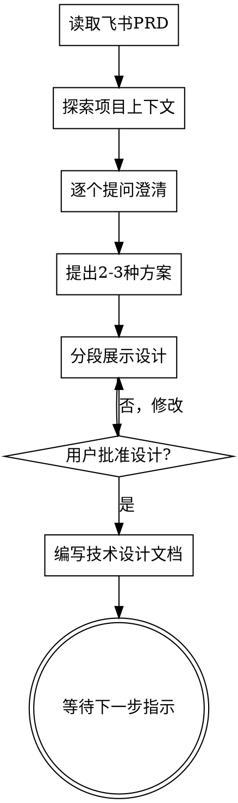

# 技术方案设计：从PRD到技术设计

## 概述

本skill根据飞书 PRD 文档和用户辅助说明，生成符合规范的服务端技术设计文档。

通过自然协作对话，将飞书 PRD 转化为完整的技术设计文档。

首先读取并理解 PRD 内容，探索当前项目上下文，然后逐个提问来细化需求。一旦完全理解，提出 2-3 种技术方案供选择，展示设计并获得用户批准。

在设计未获得批准之前，**禁止**调用任何实现技能、编写代码、搭建项目或采取任何实现行动。

## Context

- 当前路径: !`pwd`
- 当前应用名: !`basename $(pwd)`
- 当前分支: !`git rev-parse --abbrev-ref HEAD 2>/dev/null || echo "(空仓库)"`
- PRD链接: $ARGUMENTS
- 辅助说明: 从 $ARGUMENTS 中提取非链接部分

## 反面实例(模式)：「直接开始写代码」

每个功能都应该经过设计阶段。直接跳过设计会导致：
- 需求理解偏差，返工
- 技术选型不合理，重构
- 边界情况遗漏，线上问题
- 设计可以简短，但**必须展示并获得批准**

## 检查清单

必须按顺序完成以下每一步：

1. **读取 PRD** — 使用 feishu-doc-read skill 获取文档内容
2. **探索项目上下文** — 检查文件、文档、最近提交
3. **逐个提问澄清** — 一次一个问题，理解目的/约束/成功标准
4. **提出 2-3 种方案** — 说明权衡和你的推荐
5. **分段展示设计** — 根据复杂度调整，每段后获得批准
6. **编写技术设计文档** — 保存到 `./docs/{需求名称}/技术设计.md`
7. **过渡到实现** — 等待用户指示下一步

## 流程图



## 核心过程

### 理解 PRD 和需求

**读取 PRD：**
- 使用 `Skill(feishu-doc-read, "--no-save {PRD链接}")` 获取文档内容
- 提取：功能概述、用户场景、业务规则、接口需求、数据模型

**探索项目上下文：**
- 检查当前项目状态（文件、文档、最近提交）
- 使用 Glob 和 Grep 查找相关模块
- 了解现有类似功能的实现方式
- 启动探索分析，了解：
- 现有相关功能模块
- 类似功能的实现方式
- 涉及的服务/应用
- 技术栈和架构

使用 Glob 和 Grep 查找：
- 相关的 Service/Controller 类
- 相关的数据库表定义
- 相关的配置文件

**逐个提问澄清（重要）：**
逐一检查以下问题，如有任何不明确，**必须**向用户提问：

| 检查项 | 说明 | 必须明确 |
|--------|------|----------|
| 功能边界 | 需求的具体范围是什么？ | ✅ |
| 用户角色 | 谁来使用这个功能？ | ✅ |
| 核心流程 | 主要的业务流程是什么？ | ✅ |
| 输入输出 | 输入什么？输出什么？ | ✅ |
| 异常处理 | 异常场景如何处理？ | ✅ |
| 约束条件 | 有哪些技术/业务约束？ | ✅ |
| 优先级 | 哪些是必须有，哪些是可选？ | ✅ |

- 一次只问一个问题，不用多个问题压倒用户
- 优先使用选择题，但开放性问题也可以
- 如果主题需要更多探索，拆分成多个问题
- 关注点：目的、约束、成功标准、边界情况
- 必须完全理解用户需求后才能继续生成技术方案。

- 问题澄清格式
  当发现需求不明确时，使用以下格式向用户提问：
```
🤔 需求澄清

为了生成准确的技术方案，需要澄清以下问题：

Q1: {问题1}
- 当前理解：{你的理解}
- 需要确认：{具体需要确认的点}

...

请回答以上问题后，我将继续生成技术方案。
```

 3.3 等待用户澄清

- **必须等待用户回答**，不能自行猜测或假设
- 用户回答后，复述理解内容再次确认
- 如果仍有疑问，继续提问直到完全明确
- 只有当所有关键问题都明确后，才能进入下一步

只有在以下情况下才能认为需求明确：

- 能够清晰描述功能的完整流程
- 能够识别所有涉及的系统/模块
- 能够定义清晰的输入输出
- 能够识别主要的技术风险点
- 用户对上述内容没有异议


从 PRD 内容中提取一个简洁的需求名称（2-6个字），作为：
- 文档标题
- 目录名称

与用户确认需求名称是否合适。


### 步骤 6：分析改动范围

基于 PRD 和代码库分析，确定：
- 涉及的应用/服务
- 需要新增/修改的模块
- 对原有功能的影响
- 数据库变更（表结构/字段）

### 探索技术方案

**提出 2-3 种方法：**
- 每种方法说明权衡
- 以对话方式展示选项，给出推荐和理由
- 首先展示推荐选项并解释原因

**示例：**
```
针对这个需求，我看到几种实现方案：

方案 A：新增独立服务（推荐）
- 优点：解耦、独立扩展
- 缺点：增加运维复杂度
- 适用：高频、复杂业务逻辑

方案 B：在现有服务中扩展
- 优点：实现快、运维简单
- 缺点：耦合度高
- 适用：简单业务逻辑

方案 C：使用消息队列异步处理
- 优点：吞吐量高
- 缺点：实现复杂、一致性处理

推荐方案 A，因为...
```

### 展示设计

**确信理解后，分段展示设计：**
- 根据复杂度调整每部分长度
- 每个部分后询问是否正确
- 覆盖：架构、模块、数据流、接口、数据库
- 随时准备回溯澄清

**设计分段：**
1. **整体架构** — 系统架构图、核心组件
2. **数据设计** — 数据库表结构、ER图
3. **接口设计** — 前后端接口定义
4. **技术细节** — 缓存、消息队列、定时任务等
5. **非功能需求** — 性能、安全、监控
6. **上线方案** — 变更顺序、回滚方案

## 设计之后

**编写技术设计文档：**
- 保存到 `./docs/{需求名称}/技术设计.md`
- 使用标准的技术设计文档模板
- 包含：需求概述、架构设计、接口设计、数据库设计、上线方案、工作量评估

**技术设计文档模板：**
```markdown
# {需求名称}技术设计

## 一、需求内容
### 1.1 PRD地址
### 1.2 需求概述
### 1.3 用例图

## 二、技术设计方案
### 2.1 整体架构
### 2.2 核心模块设计
### 2.3 数据库设计
### 2.4 接口设计
### 2.5 技术细节（缓存/消息/定时任务）

## 三、非功能性需求
### 3.1 性能需求
### 3.2 安全需求

## 四、上线方案
### 4.1 变更顺序
### 4.2 回滚方案
### 4.3 监控方案

## 五、工作量评估
```

**下一步：**
- 等待用户指示
- 不要自动调用实现技能
- 用户决定是继续实现计划还是先评审设计

## 关键原则

| 原则 | 说明 |
|------|------|
| **一次一问** | 不要用多个问题压倒用户 |
| **选择题优先** | 比开放性问题更容易回答 |
| **YAGNI 无情** | 从所有设计中移除不必要的功能 |
| **探索替代方案** | 在定案前总是提出 2-3 种方法 |
| **渐进验证** | 展示设计，在继续前获得批准 |
| **保持灵活** | 当某事不合理时，回溯澄清 |

## 输入输出

| 项目 | 说明 |
|------|------|
| 输入 | 飞书PRD链接 + 辅助说明 |
| 输出 | `./docs/{需求名称}/技术设计.md` |
