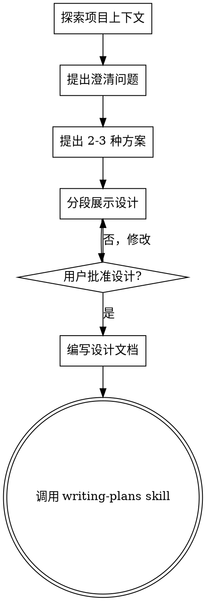

# 头脑风暴：将创意转化为设计

## 概述

通过自然的协作对话，帮助将创意转化为完整的设计和规格说明。

首先理解当前项目的上下文，然后逐个提问来细化想法。一旦理解了要构建的内容，展示设计并获得用户批准。

<HARD-GATE>
在设计未获得批准之前，**禁止**调用任何实现技能、编写代码、搭建项目或采取任何实现行动。这适用于**每个项目**，无论它看起来多简单。
</HARD-GATE>

## 反模式：「这太简单了，不需要设计」

每个项目都要经过这个过程。待办事项列表、单一功能工具、配置更改——所有项目都需要。在"简单"项目中，未经验证的假设会导致最大的工作浪费。设计可以简短（对于真正简单的项目只需几句话），但**必须展示并获得批准**。

## 检查清单

必须按顺序完成以下每一步：

1. **探索项目上下文** — 检查文件、文档、最近的提交
2. **提出澄清问题** — 一次一个，理解目的/约束/成功标准
3. **提出 2-3 种方案** — 说明权衡和你的推荐
4. **展示设计** — 分段展示，根据复杂度调整，每段后获得批准
5. **编写设计文档** — 保存到 `docs/plans/YYYY-MM-DD-<topic>-design.md` 并提交
6. **过渡到实现** — 调用 writing-plans skill 创建实现计划

## 流程图

**最终状态是调用 writing-plans**。不要调用 frontend-design、mcp-builder 或任何其他实现技能。brainstorming 之后只能调用 writing-plans。

## 核心过程

**理解想法：**
- 首先查看当前项目状态（文件、文档、最近提交）
- 一次问一个问题来细化想法
- 优先使用选择题，但开放性问题也可以
- 每条消息只问一个问题 —— 如果主题需要更多探索，拆分成多个问题
- 关注点：目的、约束、成功标准

**探索方案：**
- 提出 2-3 种不同的方法并说明权衡
- 以对话方式展示选项，给出你的推荐和理由
- 首先展示推荐选项并解释原因

**展示设计：**
- 确信理解要构建的内容后，展示设计
- 根据复杂度调整每部分长度：简单的几句话，复杂的 200-300 词
- 每个部分后询问是否正确
- 覆盖：架构、组件、数据流、错误处理、测试
- 随时准备回溯澄清

## 设计之后

**文档化：**
- 将验证后的设计写入 `docs/plans/YYYY-MM-DD-<topic>-design.md`
- 如果有 elements-of-style:writing-clearly-and-concisely skill，使用它
- 提交设计文档到 git

**实现：**
- 调用 writing-plans skill 创建详细的实现计划
- 不要调用其他 skill，writing-plans 是唯一的下一步

## 关键原则

- **一次一问** — 不要用多个问题压倒用户
- **优先选择题** — 比开放性问题更容易回答
- **YAGNI 无情** — 从所有设计中移除不必要的功能
- **探索替代方案** — 在定案前总是提出 2-3 种方法
- **渐进验证** — 展示设计，在继续前获得批准
- **保持灵活** — 当某事不合理时，回溯澄清
