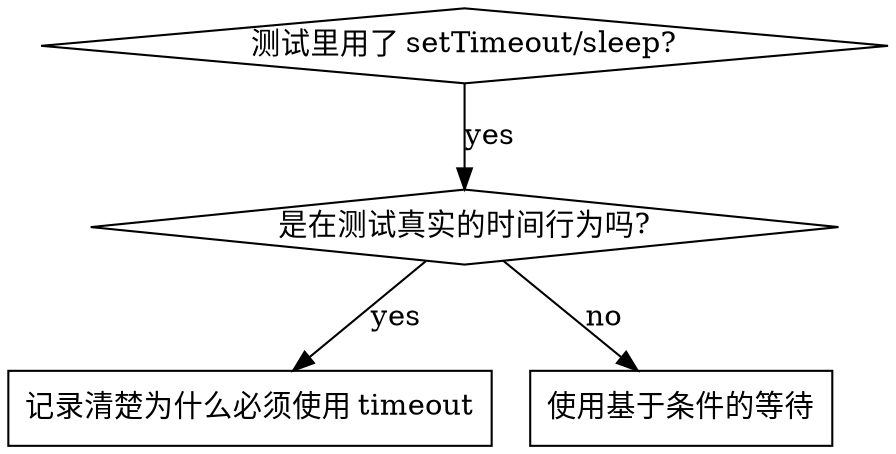

# 基于条件的等待

## 概述

不稳定测试经常通过随意设置延迟来“猜”时机。这会制造竞态条件：在快机器上测试能过，在高负载或 CI 中就失败。

**核心原则：** 等待你真正关心的条件成立，而不是猜它大概要花多久。

## 什么时候使用



**适用场景：**
- 测试里存在随意等待（`setTimeout`、`sleep`、`time.sleep()`）
- 测试时好时坏（有时通过、负载高时失败）
- 并行执行测试时经常超时
- 需要等待异步操作完成

**不适用场景：**
- 你要测试的就是时间相关行为（如 debounce、throttle 间隔）
- 如果必须使用固定超时，一定要写清楚**为什么**

## 核心模式

```typescript
// ❌ 改造前：靠猜时间
await new Promise(r => setTimeout(r, 50));
const result = getResult();
expect(result).toBeDefined();

// ✅ 改造后：等待条件成立
await waitFor(() => getResult() !== undefined);
const result = getResult();
expect(result).toBeDefined();
```

## 常见模式速查

| 场景 | 模式 |
|------|------|
| 等待事件 | `waitFor(() => events.find(e => e.type === 'DONE'))` |
| 等待状态 | `waitFor(() => machine.state === 'ready')` |
| 等待数量 | `waitFor(() => items.length >= 5)` |
| 等待文件 | `waitFor(() => fs.existsSync(path))` |
| 复杂条件 | `waitFor(() => obj.ready && obj.value > 10)` |

## 实现方式

通用轮询函数：

```typescript
async function waitFor<T>(
  condition: () => T | undefined | null | false,
  description: string,
  timeoutMs = 5000
): Promise<T> {
  const startTime = Date.now();

  while (true) {
    const result = condition();
    if (result) return result;

    if (Date.now() - startTime > timeoutMs) {
      throw new Error(`等待 ${description} 超时，已超过 ${timeoutMs}ms`);
    }

    await new Promise(r => setTimeout(r, 10)); // 每 10ms 轮询一次
  }
}
```

完整实现见本目录下的 `condition-based-waiting-example.ts`，其中包含来自真实调试会话的领域化辅助方法（`waitForEvent`、`waitForEventCount`、`waitForEventMatch`）。

## 常见错误

**❌ 轮询过快：** `setTimeout(check, 1)` —— 浪费 CPU
**✅ 正确做法：** 每 10ms 轮询一次

**❌ 没有超时：** 条件永远不满足时会无限循环
**✅ 正确做法：** 总是加上超时，并提供清晰错误信息

**❌ 使用陈旧数据：** 在循环外缓存状态
**✅ 正确做法：** 在循环内重新调用 getter，拿最新状态

## 什么情况下固定超时是合理的

```typescript
// 工具每 100ms tick 一次 —— 为验证部分输出，需要等待 2 个 tick
await waitForEvent(manager, 'TOOL_STARTED'); // 第一步：先等待触发条件
await new Promise(r => setTimeout(r, 200));   // 第二步：再等待与时间相关的行为
// 200ms = 100ms 间隔下的 2 个 tick —— 已记录且有充分理由
```

**要求：**
1. 先等待触发条件
2. 超时时长必须基于已知时序，而不是拍脑袋猜
3. 用注释说明**为什么**

## 真实世界效果

来自一次调试会话（2025-10-03）：
- 修复了 3 个文件中的 15 个 flaky 测试
- 通过率：60% → 100%
- 执行时间：快了 40%
- 不再出现竞态条件
