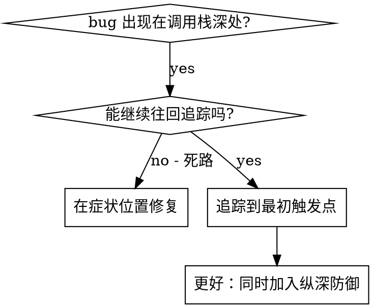
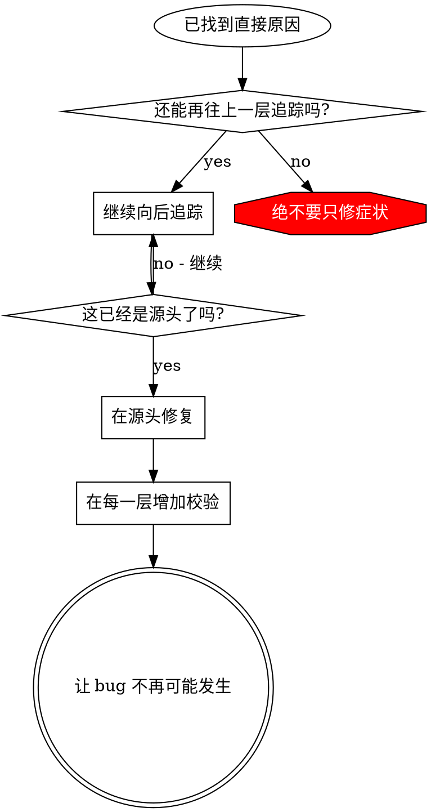

# 根因追踪

## 概述

很多 bug 会在调用栈很深的地方暴露出来（例如在错误目录执行 `git init`、文件创建到错误位置、数据库用错误路径打开）。人的本能往往是直接修报错位置，但那只是修症状。

**核心原则：** 沿着调用链向后追踪，直到找到最初的触发点，然后在源头修复。

## 什么时候使用



**适用场景：**
- 错误发生在执行流程深处，而不是入口位置
- 堆栈追踪很长
- 不清楚非法数据最初来自哪里
- 需要找出究竟是哪段测试/代码触发了问题

## 追踪流程

### 1. 观察症状
```
Error: git init failed in /Users/jesse/project/packages/core
```

### 2. 找到直接原因
**是哪段代码直接导致了这个问题？**
```typescript
await execFileAsync('git', ['init'], { cwd: projectDir });
```

### 3. 问：是谁调用了这里？
```typescript
WorktreeManager.createSessionWorktree(projectDir, sessionId)
  → 被 Session.initializeWorkspace() 调用
  → 被 Session.create() 调用
  → 被测试中的 Project.create() 调用
```

### 4. 继续往上追
**传入的值是什么？**
- `projectDir = ''`（空字符串！）
- 当 `cwd` 是空字符串时，会解析为 `process.cwd()`
- 于是就落到了源码目录！

### 5. 找到最初触发点
**空字符串最初从哪里来的？**
```typescript
const context = setupCoreTest(); // 返回 { tempDir: '' }
Project.create('name', context.tempDir); // 在 beforeEach 之前就访问了
```

## 添加堆栈追踪

如果手动追不动，就加埋点：

```typescript
// 在问题操作之前
async function gitInit(directory: string) {
  const stack = new Error().stack;
  console.error('DEBUG git init:', {
    directory,
    cwd: process.cwd(),
    nodeEnv: process.env.NODE_ENV,
    stack,
  });

  await execFileAsync('git', ['init'], { cwd: directory });
}
```

**关键点：** 在测试里使用 `console.error()`，不要用 logger——logger 可能不会输出。

**执行并采集：**
```bash
npm test 2>&1 | grep 'DEBUG git init'
```

**分析堆栈追踪：**
- 看测试文件名
- 找触发调用的具体行号
- 识别模式（是否总是同一个测试？同一个参数？）

## 找出是哪个测试造成污染

如果某个异常只会在测试期间出现，但你不知道是哪个测试引起的：

可以使用本目录下的二分脚本 `find-polluter.sh`：

```bash
./find-polluter.sh '.git' 'src/**/*.test.ts'
```

它会逐个运行测试，在发现第一个污染者时停止。具体用法见脚本本身。

## 真实例子：空的 projectDir

**症状：** `.git` 被创建在 `packages/core/`（源码目录）

**追踪链路：**
1. `git init` 在 `process.cwd()` 中执行 ← 因为 cwd 参数为空
2. WorktreeManager 被传入了空的 projectDir
3. Session.create() 传入了空字符串
4. 测试在 beforeEach 之前访问了 `context.tempDir`
5. setupCoreTest() 初始返回 `{ tempDir: '' }`

**根因：** 顶层变量初始化时过早访问了空值

**修复：** 将 tempDir 改成 getter，并在 beforeEach 之前访问时直接抛错

**同时加入了纵深防御：**
- 第 1 层：`Project.create()` 校验目录
- 第 2 层：`WorkspaceManager` 校验非空
- 第 3 层：`NODE_ENV` 守卫，拒绝在 tmpdir 之外执行 git init
- 第 4 层：在 git init 前打印堆栈

## 核心原则



**绝不要只修错误暴露出来的位置。** 一定要回溯到最初触发点。

## 堆栈追踪提示

**在测试中：** 用 `console.error()`，不要用 logger——logger 可能被吞掉
**在操作前：** 在危险操作前打印，而不是等失败后再打
**带上上下文：** 目录、cwd、环境变量、时间戳
**采集堆栈：** `new Error().stack` 可以展示完整调用链

## 真实世界效果

来自一次调试会话（2025-10-03）：
- 通过 5 层追踪找到了根因
- 在源头完成修复（getter 校验）
- 增加了 4 层防御
- 1847 个测试全部通过，零污染
